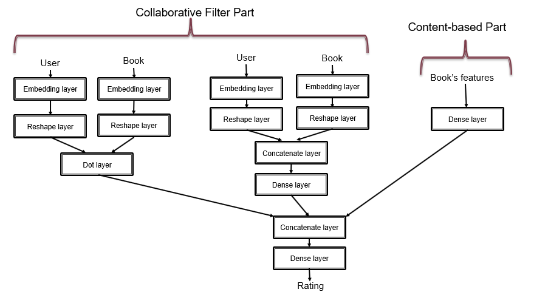
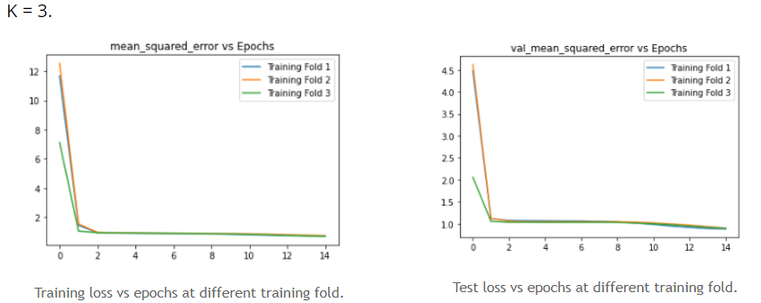
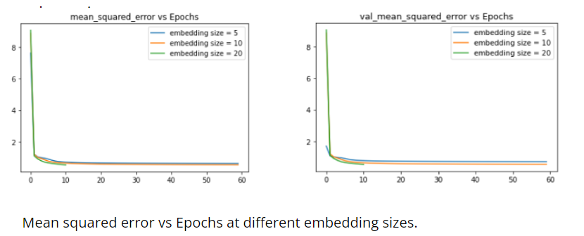
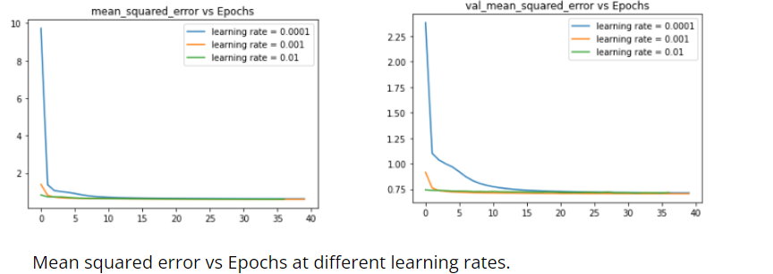
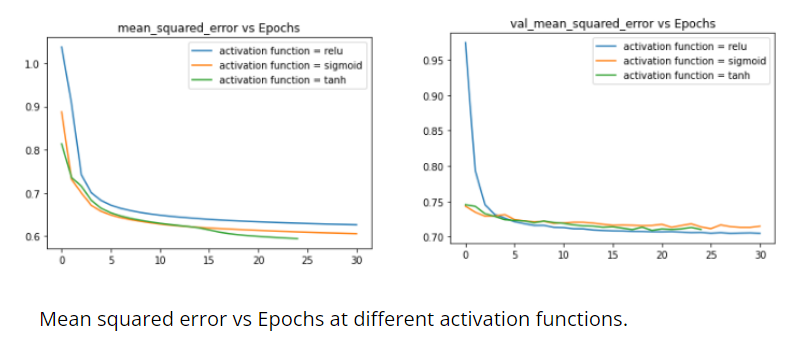
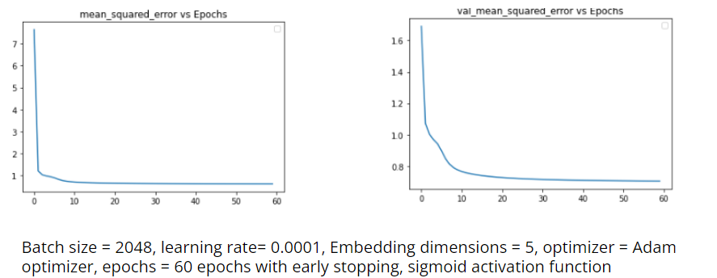

# Book-Recommender
use hybrid recommender (collaborative filtering + content based) to build a recommendation system for books.

# data set
The following link contains the data set we used, which was collected from Goodreads API, when it was available to use (now it is no longer available):
https://github.com/zygmuntz/goodbooks-10k

## Data Description
It consists of the files: ratings.csv, books.csv, book_tags.csv, and tags.csv. \
ratings.csv contains all users' ratings of the books (a total of 6 Million ratings, for 10,000 books, from 53,424 users).  \
books.csv contains information on the books such as author, average rating, etc. \
book_tags contains all tag_ids users have assigned to each book and corresponding tag_counts, while tags.csv contains the tag_names corresponding to the tag_ids. These two files are linked by the books’ ids. 

## data cleaning:
1. Books.csv doesn’t contain any duplicate books (checked the book title and authors columns for duplication). 
2. Ratings.csv doesn’t contain  duplicate user ratings for the same book (checked for duplications in the user_id and book_id columns), as one user can only give a single rating for a book. 
3.    Ratings.csv doesn’t contain any NaN values, and all the user_id and book_id are integers, and ratings are integers varying from 1 to 5. 

# The training and Testing
I have used Hybrid model (collaborative filtering + content based) to build a recommendation system for books. 
## steps
### first: Get features
We will get the books’ features or books’ genres from the tags because we don’t have genres.\
The tags are added by the users, so we will use the tags to get the genres of the books where 
1. I have hard-coded the genres. 
2. For each book, we get its tags and check if the tags contain those
hard-coded genres. 
### Second: Hybrid model architecture 

### Third: Training
We will use mean squared error as a metric to measure how good the
model is. \
I have used two techniques which are K-fold and hyperparameter tunning: 
#### K-fold
First: Split the data set into 3 groups \
Second: For each unique group: 
1. Take the group as a test data set. 
2. Take the remaining groups as a training data set. 
3. Fit a model on the training set and evaluate it on the test set. 
4. Retain the evaluation score. 

##### Mean squared error vs Epochs at different training folds:

#### Hyperparameter tuning
1. train with different hyperparameters.
2. choose the hyperparameters that give the best results. 
 

 

 

##### Mean squared error vs Epochs at best hyperparameters: 

